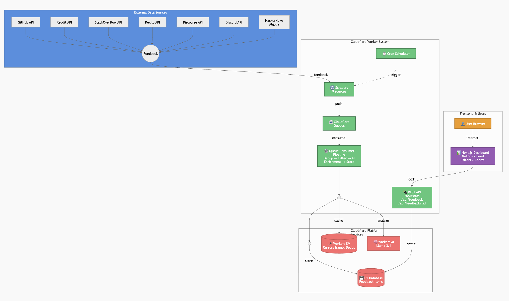
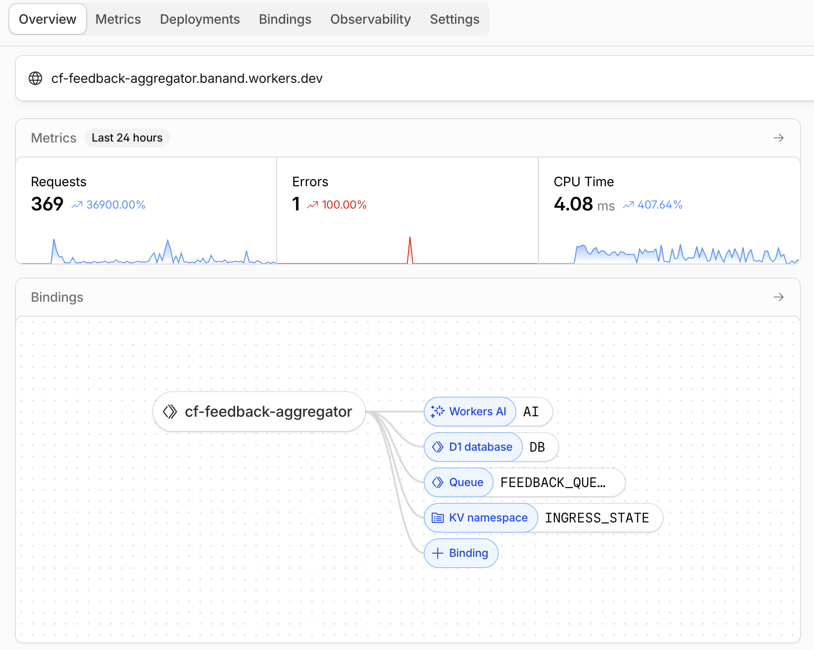
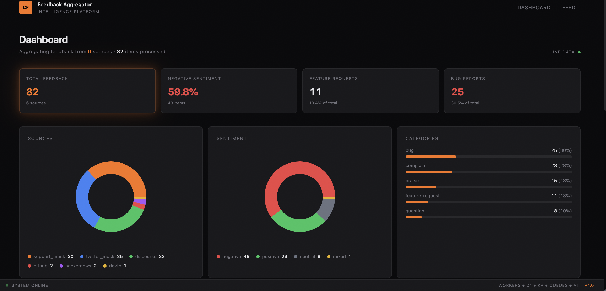
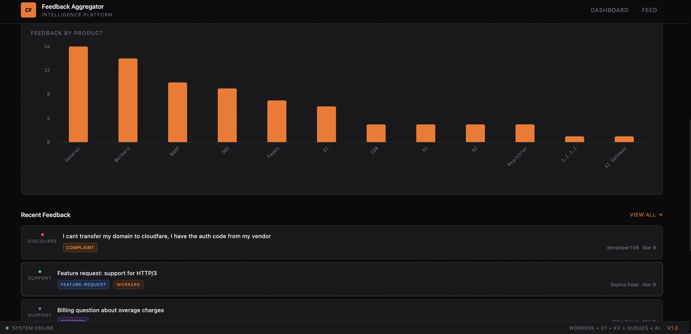
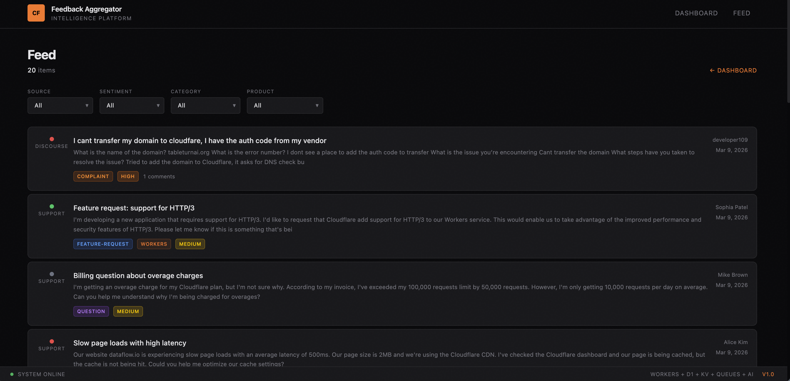

# CF Feedback Aggregator

**Cloudflare PM Intern Assignment: Product Feedback Aggregation Prototype**

A prototype that aggregates and analyzes product feedback from multiple sources (GitHub, Discourse, Reddit, Discord, HackerNews, StackOverflow, Dev.to and mock sources) so PMs can derive themes, urgency, value, and sentiment.

---

## Project Links

- **Demo (API):** https://cf-feedback-aggregator.banand.workers.dev
- **Frontend:** https://frontend.banand.workers.dev/
- **GitHub:** https://github.com/a-bhavana04/flareback/

---

## Architecture

This prototype uses **5 Cloudflare Developer Platform products**:

| Product | Purpose |
|---------|---------|
| **Workers** | HTTP API, cron triggers, queue consumer |
| **D1** | Store feedback items (source, sentiment, category, product, etc.) |
| **KV** | Deduplication state and scraping cursors for incremental fetch |
| **Queues** | Async pipeline: scrapers enqueue → consumer processes |
| **Workers AI** | Sentiment analysis and categorization (Llama 3.1) |

**Flow:** Scrapers → Queue → Consumer (dedup + AI enrichment + skip filter) → D1 → API → Frontend



### Cloudflare Workers Bindings




### Frontend Dashboard






---

## Features

- **Feedback sources:** GitHub, Discourse, Reddit, Discord, HackerNews, StackOverflow, Dev.to, mock tweets, mock support tickets
- **AI enrichment:** Sentiment, category (bug/feature-request/question/praise/complaint), product, priority
- **Noise filtering:** Skips short reactions ("oh totally", "lol") and non-substantive content
- **HackerNews context:** Shows where Cloudflare was referenced (title, article, comment)
- **Dashboard:** Stats, charts (sources, sentiment, categories, products), recent feedback
- **Feed:** Filterable, paginated list with badges

---

## Quick Start

```bash
npm install
npx wrangler login
npx wrangler d1 execute feedback-db --remote --file=./migrations/0001_init.sql
npx wrangler deploy
```

See [migrate.md](migrate.md) for full setup (D1, KV, Queue creation, secrets).

### Trigger Ingestion

```bash
# Reset cursors after DB purge (so scrapers fetch from the beginning)
curl -X POST "https://cf-feedback-aggregator.banand.workers.dev/api/ingest/reset-cursors"

# Trigger all sources
curl -X POST "https://cf-feedback-aggregator.banand.workers.dev/api/ingest/trigger?source=all"
```

---

## API

| Endpoint | Method | Description |
|----------|--------|-------------|
| `/api/stats` | GET | Aggregated counts by source, sentiment, category, product |
| `/api/feedback` | GET | List items. Params: `source`, `sentiment`, `category`, `product`, `limit`, `offset` |
| `/api/feedback/:id` | GET | Single item |
| `/api/ingest/trigger?source=` | POST | Trigger scraper. Values: `github`, `discourse`, `reddit`, `discord`, `hackernews`, `stackoverflow`, `devto`, `twitter_mock`, `support_mock`, `all` |
| `/api/ingest/reset-cursors` | POST | Reset KV cursors (use after DB purge to re-fetch) |

---
